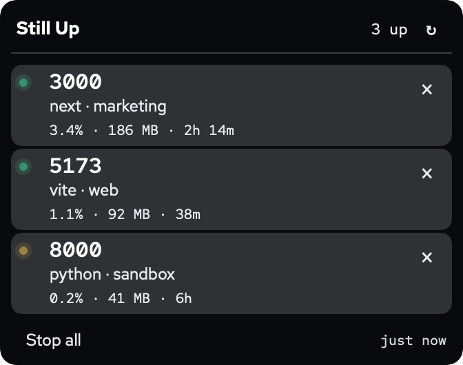
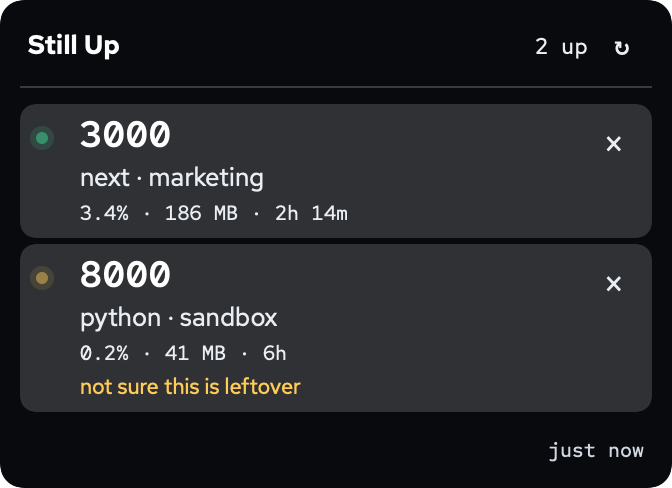
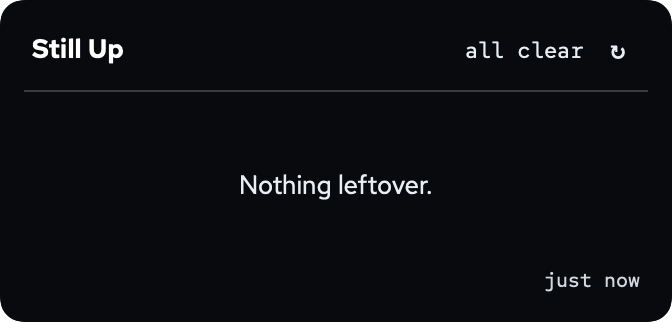

# Still Up

A macOS menu bar app for leftover dev servers.

<p align="center">
  
</p>

Click a row to open that server, or to switch to the browser tab already on it. Command-click always opens a new tab. The × stops that process. **Stop all** clears the ones it's sure about.

<p align="center">
  
</p>

A green dot means the port answered HTTP. Amber means something is listening, and Still Up isn't sure it's a leftover dev server. You can still stop it. Stop all leaves it alone.

<p align="center">
  
</p>

The pictures above use sample projects.

## Install

Download [Still Up for macOS](https://github.com/sahkilic/still-up/releases/latest/download/Still-Up.zip) (macOS 14 or newer). Unzip it and drag Still Up into Applications.

The app isn't notarized. The first time, right-click it, choose Open, then Open again.

To build it yourself, you need Xcode.

```bash
./build-app.sh
open "dist/Still Up.app"
```

## What it leaves alone

Control Center, AirPlay, Cursor, Dropbox, Docker, databases, and other apps that just happen to hold a port. What's left looks like Next, Vite, uvicorn, and similar.

## Privacy

Nothing leaves your Mac. There is no account and no telemetry. To focus a tab you already have open, it reads browser tab URLs on your machine. The only network requests are to your own localhost ports, to see if they're answering.

## Develop

```bash
swift test
swift run still-up -- --preview
```

`swift test` checks the classifier, the process listings, and which browser tab gets focused. `swift run` with `--preview` opens the panel immediately and leaves it open.

## License

[MIT](LICENSE)
